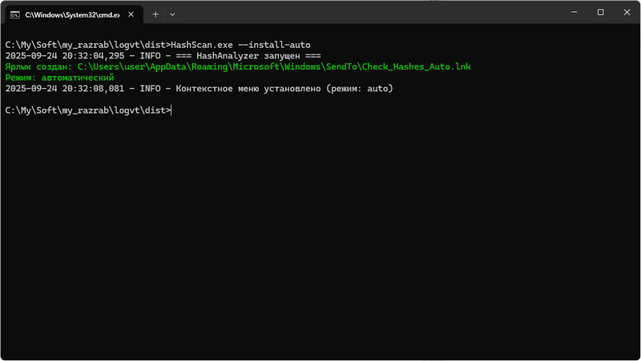
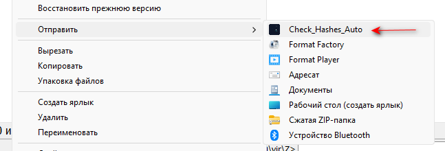
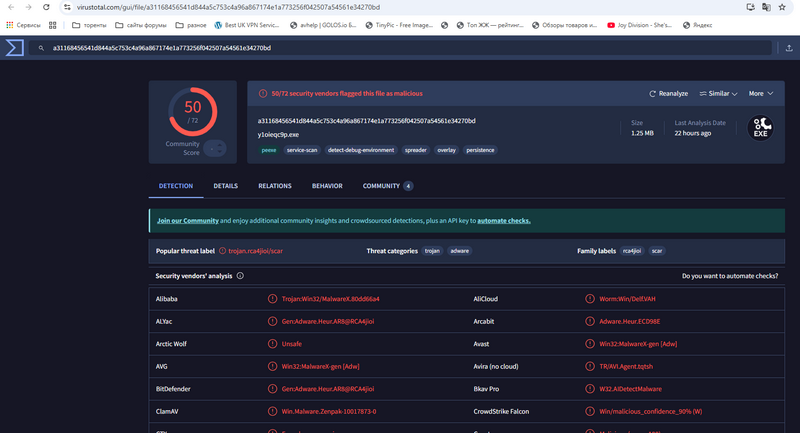
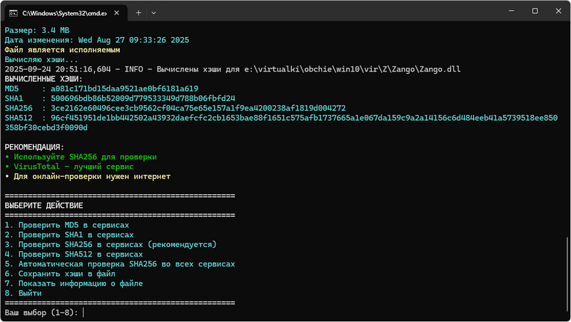

# HashScan

**HashScan** - это инструмент для анализа хэшей файлов с возможностью проверки через онлайн-сервисы безопасности (VirusTotal, VirSCAN, Kaspersky)

## Зачем я это сделал

Это мой взгляд это идеальный вариант утилиты, которая ищет хэши на онлайн-сервисах проверки программ на наличие зловредного кода. Можно сразу проверить хэш на трех ресурсах. Это консольная утилита. Но она очень простая в использовании.

## Простой пример для проверки файлов через контекстное меню

Допустим, нужно двумя кликами проверить любой файл в Проводнике, без всяких запросов:
```cmd
HashScan.exe --install-auto
```



После этой команды проверяйте любые файлы через контекстное меню: правой кнопкой мыши по файлу → Отправить → Check_Hashes_Auto. Результаты сканирования файла откроются в браузере (откроется три страницы).





GUI:


4. Проверить SHA512 в сервисах
5. Автоматическая проверка SHA256 во всех сервисах
6. Сохранить хэши в файл
7. Показать информацию о файле
8. Выйти



Т.е. можно рассчитать различные варианты хэшей (MD5, SHA1, SHA256, SHA512), проверить на сервисах, сохранить хэши в файл (`имя_файла_время_hashes.txt`).

Логирование работы программы сохраняется в файл `hash_analyzer.log` 

## Параметры утилиты и примеры:
```cmd
Базовая установка (все режимы):
HashScan.exe --install
Установка отдельных режимов:
# Только автоматический режим
HashScan.exe --install-auto
# Только интерактивный режим  
HashScan.exe --install-interactive
# Только быстрый режим (только хэши)
HashScan.exe --install-quick
Удаление из меню:
HashScan.exe --uninstall

Через командную строку
# Автоматическая проверка (открывает все сервисы)
HashScan.exe suspicious_file.exe --auto
# Только вычисление хэшей
HashScan.exe suspicious_file.exe --quick

# Интерактивный режим (по умолчанию)
HashScan.exe suspicious_file.exe
# Перетаскивание файла на EXE (интерактивный режим)

Примеры использования
Пример 1: Быстрая проверка подозрительного EXE
HashScan.exe malware.exe --auto
Результат: Откроются 3 вкладки в браузере с проверкой файла

Пример 2: Детальный анализ DLL файла
HashScan.exe suspicious.dll
Результат: Интерактивное меню с выбором действий

Пример 3: Получение хэшей для документации
HashScan.exe software.zip --quick
Результат: Вывод хэшей в консоль

Пример 4: Проверка через контекстное меню
Правой кнопкой на virus.exe
Отправить → Check_Hashes_Auto
Автоматически откроются сервисы проверки

```


